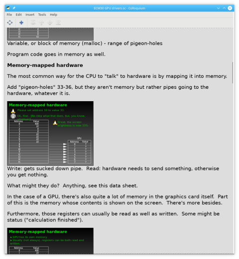
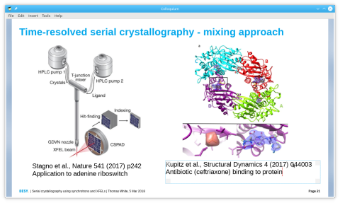
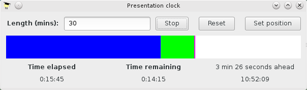

Colloquium: Narrative-based presentation system
===============================================

Colloquium is a new approach to presentation tools which centres on _narrative_, not _slides_.

In Colloquium, rather than acting as the framework for your words, slides are embedded into the "narrative" of your presentation and only come into play when there's a need for a visual aid.  Concentrating on the narrative makes it much easier to give a clear presentation which flows naturally.

You can use the narrative in whatever way you like, which could range from short bullet-pointed notes all the way up to writing your talk word-for-word.

---

Within the narrative, you can double-click a slide to open it in a familiar kind of editor.  Drag and drop images, shift-drag to create text boxes, and so on.  A stylesheet system helps to enforce design consistency.

---

Colloquium's presentation clock shows the passage of time and your progress through the talk on a bar chart.  When you're running fast, the difference is coloured green.  If you're running slow, it's red.  You can see at a glance how you're doing, even though all slides do not take an equal amount of time.

---

Colloquium stores your presentations in a transparent, plain text format.  Files behave well with all version control systems for easy tracking and merging of changes.  You can easily edit files by hand if you need to, or even generate them programmatically.

Here's how it looks, in case you were wondering:

    : This is an example file.  This line is normal narrative text
    SLIDE {
        SLIDETITLE: Here is the title of the slide
        IMAGE[1fx1f+0+0]: /home/user/image.png
    }
    : Here is some more narrative text

Installation instructions
-------------------------

Colloquium uses the Meson build system (http://mesonbuild.com), which works
with Ninja (https://ninja-build.org/).  Start by installing these if you don't
already have them.  For example, in Fedora:

    $ sudo dnf install meson ninja-build

or for Debian/Ubuntu:

    $ sudo apt install meson ninja-build

or for Mac OS users, using Homebrew (https://brew.sh):

    $ brew install meson ninja

You will also need the gettext and GTK 3 development files:

    $ sudo dnf install gettext-devel gtk3-devel

or:

    $ sudo apt install gettext-devel libgtk-3-dev

or:

    $ brew install gettext gtk+3

This should pull in the other dependencies, which are GDK, GLib, GIO, Cairo,
Pango and gdk-pixbuf.  You may need to additionally install Flex and Bison.

Set up the build directory using Meson:

    $ meson build

Compile Colloquium using Ninja:

    $ ninja -C build

To install:

    $ sudo ninja -C build install

Running the program
-------------------

Colloquium should appear in your desktop environment's menus.  Alternatively,
it can be started from the command line:

    $ colloquium

The first time Colloquium runs, it will show an introduction document to help
you get started.

Presentation tips
-----------------

[Look here](doc/presentation-tips.md) for a collection of useful presentation tips.

Contributing
------------

Comments and suggestions welcome. Feel free to email me (taw@bitwiz.me.uk)!

More information, including presentation tips, on my website: https://www.bitwiz.me.uk/colloquium

File bug reports and feature requests here:  https://github.com/taw10/colloquium/issues

Clone from either GitHub or my private repository:

    $ git clone git://git.bitwiz.me.uk/colloquium.git
    $ git clone https://github.com/taw10/colloquium.git

Browse the repositories:  https://git.bitwiz.me.uk/?p=colloquium.git or https://github.com/taw10/colloquium

Licence
-------

Copyright © 2017-2020 Thomas White <taw@bitwiz.me.uk>

This program is free software: you can redistribute it and/or modify
it under the terms of the GNU General Public License as published by
the Free Software Foundation, either version 3 of the License, or
(at your option) any later version.

This program is distributed in the hope that it will be useful,
but WITHOUT ANY WARRANTY; without even the implied warranty of
MERCHANTABILITY or FITNESS FOR A PARTICULAR PURPOSE.  See the
GNU General Public License for more details.

You should have received a copy of the GNU General Public License
along with this program.  If not, see <http://www.gnu.org/licenses/>.
