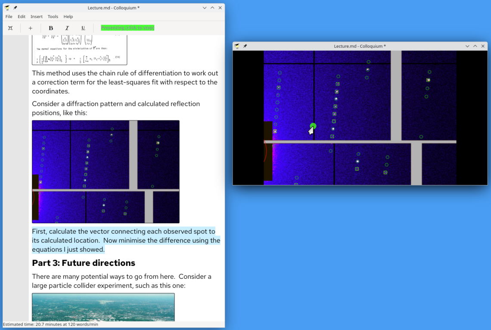

Colloquium: Narrative-based presentation system
===============================================

Colloquium gives you the missing tools you need for giving confident, clear and coherent talks, picking up where traditional presentation tools ("slideware") leave off.  It begins by taking the familiar process of preparing slides with accompanying notes, and turns it inside-out to embed your visual aids within a flow of text.

You can make your visual aids (slides) any way you like, with supported formats including SVG, PNG and PDF. Use a slide design package (LibreOffice Impress, Powerpoint) if you want, or take advantage of a more powerful graphics program (suggestion: [Inkscape](https://inkscape.org/)).  Alternatively, keep things simple by using unadorned images and let Colloquium take care of displaying them, or speak without any graphics at all - Colloquium will still help you out.

### Never run over time

Among Colloquium's tools are a timer which understands the realities of public speaking.  It lets you know if you're running behind or ahead of time *during the presentation*, not just at the end when it's too late to do anything about it.  It can even keep time for the Q&A session following your talk, automatically shortening the discussion period if your talk runs over time.

### Additional superpowers

* Markdown-based plain text file format, compatible with all version control systems for easy tracking and merging of changes.

* Native support for gyroscope/accelerometer-based presentation remote controls, e.g. Logitech Spotlight.

* Great support for virtual and hybrid presentations.  Open multiple views of your slideshow, and they will all be synchronised (including a virtual laser pointer).  Put one on the projector in the meeting room, one on your own private monitor, and one on a shared screen (e.g. a Wayland virtual output).

Installation
------------

Colloquium uses the Meson build system (http://mesonbuild.com).  You will also need the gettext and GTK 4 development files, as well as Poppler (PDF rendering library), MD4C (Markdown parser) and librsvg (SVG renderer):

    $ sudo dnf install gettext-devel gtk4-devel md4c-devel poppler-glib librsvg2-devel

or:

    $ sudo apt install gettext-devel libgtk-4-dev libmd4c-dev libpoppler-glib-dev librsvg2-dev

or:

    $ brew install gettext gtk4 poppler md4c librsvg

This should pull in the other dependencies, which are GDK, GLib, GIO, Cairo, Pango and gdk-pixbuf.

Set up the build directory and compile using Meson:

    $ meson build
    $ meson compile -C build

To install (Meson will ask for increased privileges if required):

    $ meson install -C build

Running the program
-------------------

Colloquium should appear in your desktop environment's menus.  Alternatively, it can be started from the command line:

    $ colloquium

The first time Colloquium runs, it will show an introduction document to help you get started.

Presentation tips
-----------------

[Look here](doc/presentation-tips.md) for a collection of useful presentation tips.

Contributing
------------

Comments and suggestions are welcome. Feel free to email me (taw@bitwiz.me.uk) or file bug reports and feature requests here:  https://github.com/taw10/colloquium/issues

Clone from either GitHub or my private repository:

    $ git clone git://git.bitwiz.me.uk/colloquium.git
    $ git clone https://github.com/taw10/colloquium.git

Browse the repositories:  https://git.bitwiz.me.uk/?p=colloquium.git or https://github.com/taw10/colloquium

History
-------

Colloquium has accompanied me over more than a decade as my approach to presentations evolved.  The project has evolved beyond recognition, while maintaining an almost linear Git history.  Here are some historical notes.

Development began in May 2011 because I was frustrated by the then-sluggishness of OpenOffice Impress.  The very first version was a conventional slide-based program based on GTK+2 and built with GNU Autotools.  It stored documents using an INI-like format.  The most interesting feature was probably its ability to jump around in the slide deck just using a presentation remote, by using the "pause" button ("B" key) to disconnect changes of slide on the screen from those on the projector.  See [6d919c7f](../../commit/6d919c7f8d79a098704813dfeecf8a88b4348e68).

Starting in April 2012, I tried to make things more elegant by adding a TeX-like markup language for the text inside frames on slides, while building the text rendering (and editing) up from the ground with low-level Pango calls (Note: *do not try this!*  I can personally confirm that [text rendering hates you](https://faultlore.com/blah/text-hates-you/), and that [text editing hates you too](https://lord.io/text-editing-hates-you-too/)).  Colloquium moved from GTK+2 to GTK+3 around this time.  See [90030e0d](../../commit/90030e0d42f89a9c4e1137bf0b5f556bfe221dcb).

Starting in January 2014, I extended the TeX-like markup language to describe the entire contents of the presentation, not just the text within frames on the slides.  Although not my original intention, this led naturally to the narrative-first way of working which came to be Colloquium's headline feature.  Realising the folly of trying to implement low-level text rendering, I switched over to high-level driver objects (PangoLayout) instead.  This version separated the style information into a JSON file, which made switching styles easy, even if it usually didn't work very well.  See [c41fa6a9](../../commit/c41fa6a9efb39e4fd0a964b7a83000647e4d32bf).

Near the end of 2018, I learnt how to write a "real" parser using Bison, and switched over to a simpler markup language.  The new language was part-way between the previous TeX-style version (which was fragile to edit and not very readable) and the much older INI-style language (which was wasteful in file size).  Colloquium had switched from Autotools to Meson by this time (a huge improvement!).  See [20445851](../../commit/20445851914403052d61a137f2d207bf23791cf2).

Realising that mainstream slideware had improved, but also not wanting to abandon narrative-based talk preparation, the latest iteration (starting in early 2025) includes no slide layout tools whatsoever.  It replaces the custom file format with Markdown, and styling is now considered a user preference rather than part of the document.  Colloquium has also migrated to GTK4, and the custom text editor widget (which was *still* unmanagably complicated) has been replaced with a standard GtkTextView.

Through all of these incarnations, Colloquium remained functional enough for me to use in front of real audiences.  Who knows how it will evolve in the future, but I have some ideas...

Licence
-------

Copyright © 2011-2025 Thomas White <taw@bitwiz.me.uk>

This program is free software: you can redistribute it and/or modify it under the terms of the GNU General Public License as published by the Free Software Foundation, either version 3 of the License, or (at your option) any later version.

This program is distributed in the hope that it will be useful, but WITHOUT ANY WARRANTY; without even the implied warranty of MERCHANTABILITY or FITNESS FOR A PARTICULAR PURPOSE.  See the GNU General Public License for more details.

You should have received a copy of the GNU General Public License along with this program.  If not, see <http://www.gnu.org/licenses/>.
